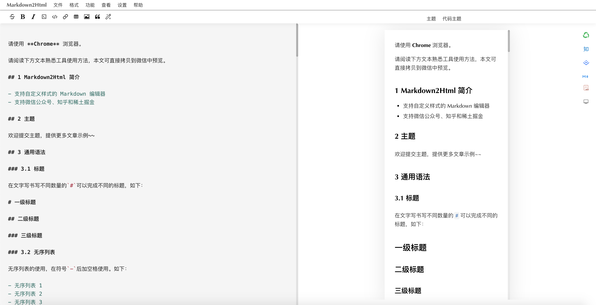

<div align="center">
<a href="http://md.aizhuanqian.online">

</a>
</div>
<h1 align="center">Markdown2Html</h1>

## 简介

- 支持自定义样式的 Markdown 编辑器
- 支持微信公众号、知乎和稀土掘金
- 支持公式
- 支持html转markdown
- 支持导出pdf和markdown
- 支持 Obsidian 一键排版和复制
- 欢迎[在线使用](http://md.aizhuanqian.online/)

## 主题

> 欢迎提交主题，提供更多文章示例~~

## 部署说明

### 通过 Docker 部署

1. 确保已安装 Docker。
2. 在项目根目录下运行以下命令构建 Docker 镜像：
   ```bash
   docker build -t markdown2html-obsidian .
   ```
3. 使用以下命令运行 Docker 容器：
   ```bash
   docker run -p 3000:3000 markdown2html-obsidian
   ```

### 使用 Node.js 部署

1. 确保已安装 Node.js v16。
2. 在项目根目录下运行以下命令安装依赖：
   ```bash
   yarn install
   ```
3. 使用以下命令启动项目：
   ```bash
   npm run start
   ```

确保在项目启动前，已正确配置环境变量和依赖。

## Obsidian 插件使用说明

### 安装插件

1. 下载 `obsidian-plugin` 目录
2. 将其复制到你的 Obsidian 插件目录（通常是 `.obsidian/plugins/obsidian-markdown2html`）
3. 在 Obsidian 中启用插件

### 使用方法

插件提供两种使用方式：

1. **复制模式**（推荐）
   - 点击工具栏的复制图标，或使用命令面板输入"复制当前文档到剪贴板"
   - 直接粘贴到编辑器中
   - 本地图片会自动上传到配置的图床

2. **浏览器模式**
   - 点击工具栏的文档图标，或使用命令面板输入"在浏览器中打开当前文档"
   - 文档将在浏览器中打开

### 特性

- 一键复制：直接复制到剪贴板，无需打开浏览器
- 智能图片处理：
  - 自动检测本地图片
  - 自动转换为 base64 格式
  - 自动上传到配置的图床
  - 支持批量处理多张图片
  - 保持图片原有格式和大小

### 配置说明

1. 在 Obsidian 设置中找到 "Markdown2HTML" 设置选项
2. 配置服务器地址（默认为 `http://localhost:3000`）
3. 如果你使用在线服务，可以将地址改为 `http://md.aizhuanqian.online`

## 主程序功能特性

- ✨ 支持自定义样式的 Markdown 编辑器
- 📱 支持微信公众号、知乎和稀土掘金
- 📊 支持数学公式
- 🔄 支持 HTML 转 Markdown
- 📥 支持导出 PDF 和 Markdown
- 🖼️ 支持多种图床
  - GitHub 图床
  - 腾讯云 COS 图床
  - 其他图床开发中...
- 🌈 提供多种主题选择

## 使用说明

### 图床配置

1. GitHub 图床配置：
   - 在 GitHub 设置中生成个人访问令牌（Personal Access Token）
   - 在应用设置中配置 GitHub 图床信息：
     - Token：你的访问令牌
     - 用户名：GitHub 用户名
     - 仓库名：用于存储图片的仓库
     - 分支名：默认为 main

2. 腾讯云 COS 图床配置：
   - 在腾讯云控制台创建存储桶（Bucket）
   - 获取访问密钥（SecretId 和 SecretKey）
   - 在应用设置中配置腾云 COS 信息：
     - SecretId：访问密钥 ID
     - SecretKey：访问密钥密码
     - Bucket：存储桶名称（格式：BucketName-APPID）
     - Region：存储桶所在地域（例如：ap-nanjing）

### 环境要求

- Node.js v16
- 支持 Windows、Linux 和 macOS
- WSL2（Windows 用户推荐）

## 开发说明

1. 克隆项目：
   ```bash
   git clone https://github.com/yourusername/markdown2html-obsidian.git
   ```

2. 配置 Git（重要）：
   ```bash
   # 配置 pull 策略为 merge（推荐）
   git config pull.rebase false
   
   # 或者使用 rebase 策略
   # git config pull.rebase true
   
   # 或者只允许 fast-forward
   # git config pull.ff only
   ```

3. 安装依赖：
   ```bash
   yarn install
   ```

4. 启动开发服务器：
   ```bash
   npm run start
   ```

5. 构建项目：
   ```bash
   npm run build
   ```

## 贡献指南

欢迎提交 Pull Request 或提出 Issue。

## 支持的格式

### 基础语法
- 标题（h1~h6）
- 列表（有序、无序、任务列表）
- 引用块
- 表格
- 代码块（支持语法高亮）
- 链接和图片
- 粗体、斜体、删除线

### 扩展语法
- 数学公式（支持 `$` 和 `$$` 语法）
- 目录生成（使用 `[toc]`，支持二级和三级标题）
- 脚注
- 定义列表
- 图片扩展
  - 支持设置图片尺寸
  - 支持横屏显示
  - 支持图示说明
- 注音符号

### 特殊功能
- 代码高亮：支持多种编程语言
- 表格增强：自动添加容器和样式
- 列表优化：自动优化列表样式
- TOC 目录：自动生成文章目录
- 全平台兼容：
  - 支持微信公众号排版
  - 支持知乎专栏排版
  - 支持掘金社区排版

### 图片功能
- 支持图片上传到多种图床
- 支持图片大小调整
- 支持图片说明文字
- 支持外部图片链接转换
- 自动处理图片缓存

## 友情链接

- [markdown nice](https://mdnice.com/)：markdown nice

## 许可证

MIT License
