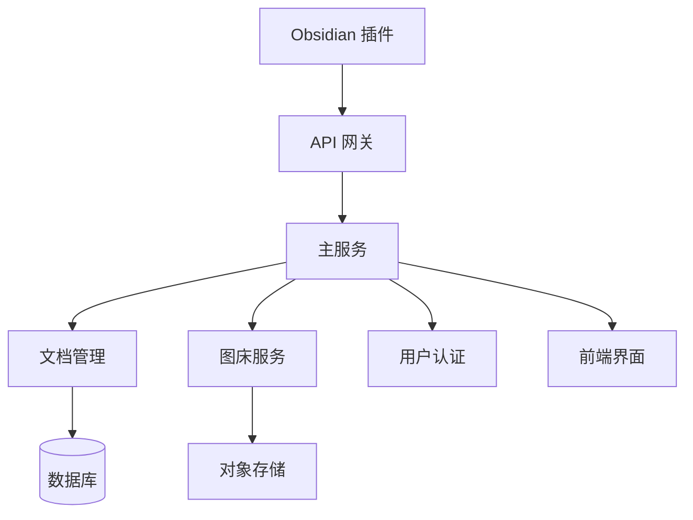

# Markdown2Html V2.0 系统设计文档

## 1. 系统架构

### 1.1 整体架构


### 1.2 核心模块

1. **文档管理模块**
   - 文档存储和检索
   - 版本控制
   - 元数据管理
   - 分类和标签

2. **图床服务模块**
   - 多图床支持
   - 图片处理
   - 配置同步
   - 上传管理

3. **用户系统模块**
   - 用户认证
   - 权限管理
   - 配置管理
   - API 密钥管理

4. **前端界面模块**
   - 文档编辑器
   - 样式设置
   - 文档管理界面
   - 配置管理界面

5. **API 系统模块**
   - RESTful 接口
   - 认证中间件
   - 请求限流
   - 错误处理

## 2. 数据模型

### 2.1 文档模型
```typescript
interface Document {
  id: string;
  title: string;
  content: string;
  userId: string;
  status: 'draft' | 'published';
  createTime: DateTime;
  updateTime: DateTime;
  tags: string[];
  images: Image[];
  version: number;
}

interface Image {
  id: string;
  documentId: string;
  originalPath: string;
  fileName: string;
  uploadedUrl: string;
  size: number;
  createTime: DateTime;
}
```

### 2.2 用户模型
```typescript
interface User {
  id: string;
  username: string;
  email: string;
  apiKeys: ApiKey[];
  imageBedConfigs: ImageBedConfig[];
  preferences: UserPreference;
}

interface ApiKey {
  id: string;
  userId: string;
  key: string;
  name: string;
  lastUsed: DateTime;
  permissions: string[];
}
```

## 3. API 设计

### 3.1 文档管理 API
```typescript
// 文档操作
POST   /api/v2/documents           // 创建文档
GET    /api/v2/documents           // 获取文档列表
GET    /api/v2/documents/:id       // 获取文档详情
PUT    /api/v2/documents/:id       // 更新文档
DELETE /api/v2/documents/:id       // 删除文档

// 图片处理
POST   /api/v2/documents/:id/images  // 上传图片
PUT    /api/v2/documents/:id/images  // 更新图片
DELETE /api/v2/documents/:id/images  // 删除图片
```

### 3.2 用户认证 API
```typescript
POST   /api/v2/auth/login         // 用户登录
POST   /api/v2/auth/token         // 获取 API Token
GET    /api/v2/auth/validate      // 验证 Token
POST   /api/v2/auth/refresh       // 刷新 Token
```

### 3.3 配置管理 API
```typescript
GET    /api/v2/config/imagebed     // 获取图床配置
PUT    /api/v2/config/imagebed     // 更新图床配置
GET    /api/v2/config/preference   // 获取用户偏好
PUT    /api/v2/config/preference   // 更新用户偏好
```

## 4. 实现步骤

### 4.1 Phase 1: 基础架构
1. 项目初始化
   - 创建新的项目结构
   - 设置开发环境
   - 配置构建工具

2. 数据库设计
   - 设计数据表结构
   - 创建迁移脚本
   - 设置测试数据

3. API 框架
   - 实现基础 API 结构
   - 添加认证中间件
   - 设置错误处理

### 4.2 Phase 2: 核心功能
1. 文档管理功能
   - 实现文档 CRUD
   - 添加版本控制
   - 实现文档搜索

2. 图片处理功能
   - 图片上传处理
   - 图床集成
   - 图片管理接口

3. 用户系统
   - 用户认证
   - API 密钥管理
   - 权限控制

### 4.3 Phase 3: Obsidian 插件
1. 插件开发
   - 基础框架搭建
   - API 集成
   - 用户界面

2. 功能实现
   - 文档上传
   - 图片处理
   - 配置同步

### 4.4 Phase 4: 前端优化
1. 用户界面
   - 文档管理界面
   - 配置管理界面
   - 样式编辑器优化

2. 功能增强
   - 批量操作
   - 拖拽上传
   - 实时预览

## 5. 技术栈

### 5.1 后端
- Node.js + TypeScript
- Express/Nest.js
- PostgreSQL
- Redis
- Docker

### 5.2 前端
- React + TypeScript
- Ant Design
- MobX
- CodeMirror

### 5.3 Obsidian 插件
- TypeScript
- Obsidian API
- React (可选)

## 6. 开发计划

### 6.1 时间线
1. Phase 1: 2-3 周
2. Phase 2: 3-4 周
3. Phase 3: 2-3 周
4. Phase 4: 2-3 周

### 6.2 优先级
1. 高优先级
   - 文档管理基础功能
   - 图片上传和处理
   - API 认证系统

2. 中优先级
   - Obsidian 插件
   - 用户界面优化
   - 批量操作功能

3. 低优先级
   - 高级搜索功能
   - 数据分析
   - 自动化测试

## 7. 注意事项

### 7.1 安全性
- API 认证和授权
- 数据加密
- 文件上传验证
- 请求限流

### 7.2 性能
- 图片处理优化
- 数据库索引
- 缓存策略
- 并发处理

### 7.3 可扩展性
- 模块化设计
- 插件系统
- API 版本控制
- 配置中心

### 7.4 用户体验
- 错误处理
- 加载状态
- 操作反馈
- 帮助文档 